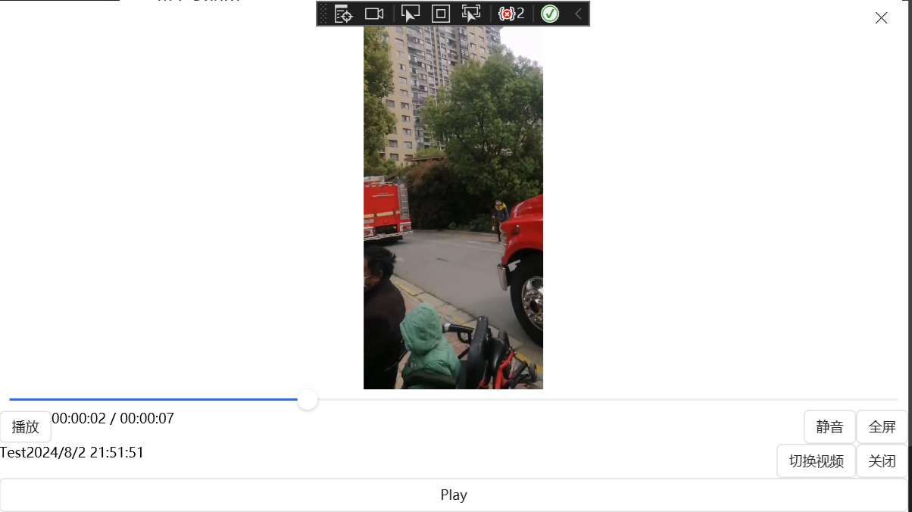

# WPFVlcSharp

#### 介绍
使用VLCSharp编写的接触播放器界面

测试代码时记得调整测试视频的路径(默认为string url = "C:\\Users\\ives\\Desktop\\zhaohuo.mp4")

#### 软件架构
WPF
VLCSharp
.net6
handycontrol

#### 使用说明

1.  支持点击界面移动窗口
2.  支持全屏、ESC退出全屏
3.  暂停、播放
4.  静音
5.  支持点击进度条位置&拖动进度条位置

#### 参与贡献

1.  Fork 本仓库
2.  新建 Feat_xxx 分支
3.  提交代码
4.  新建 Pull Request

#### TODO

1.  切换视频
